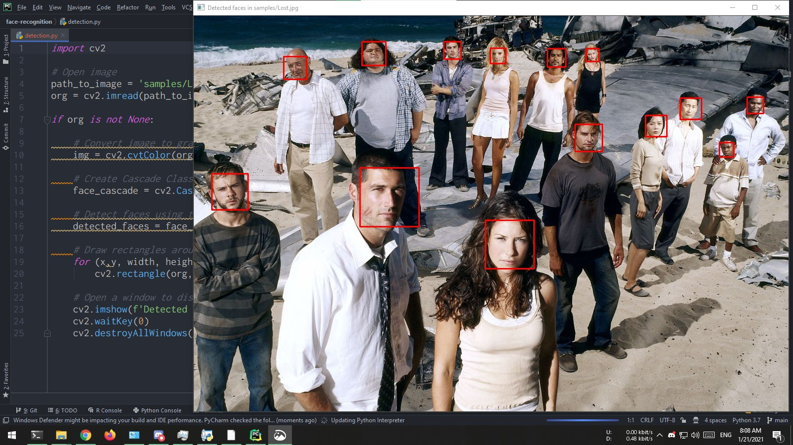
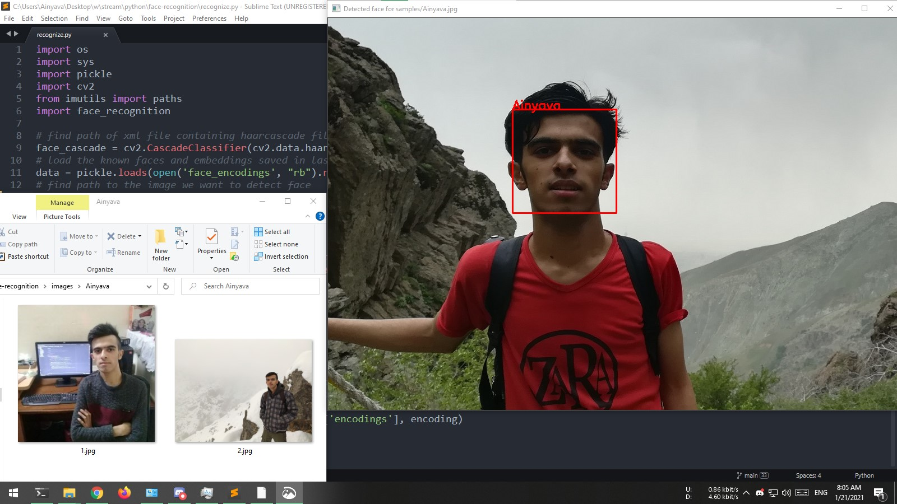
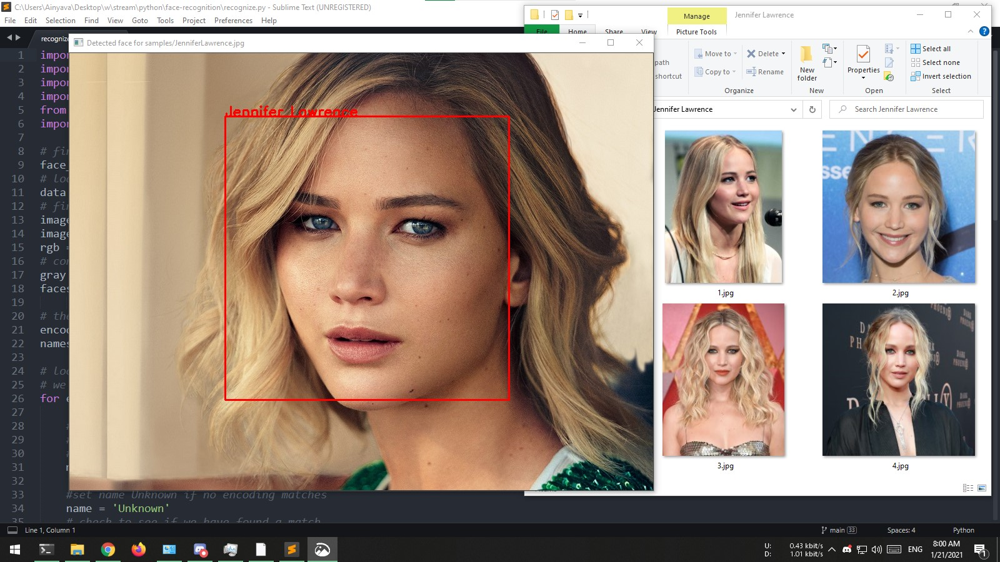
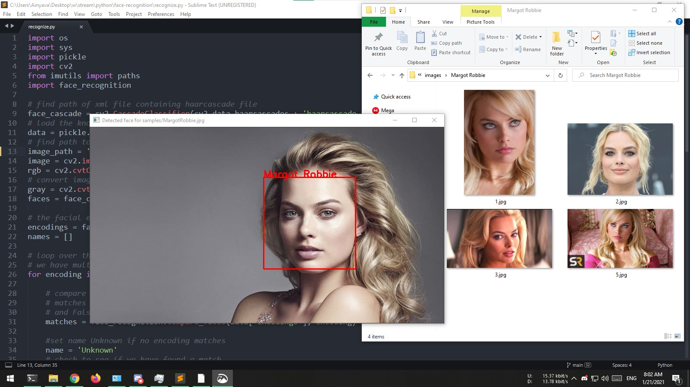

# Face Recognition
Some face recognition scripts written with **Python** using **OpenCV** and **face_recognition** libraries.

---

### Requirements
first we need to setup our environment to run the applications so for that:

#### Windows

1. you use windows I recommend using [Anaconda](https://www.anaconda.com/products/individual#Downloads) for python installation because we need some tools that installing them manually is little bit hard.

2. After installing **Anaconda** we have **Python** but we need a **C++ compiler** because they used C++ to develop **OpenCV**. I recommend using **Microsoft Visual C++** because it's more compatible with Windows but feel free to use anything else.

    I had Installed Visual Studio with C++ but I dont know if Runtime alone works (let me know!)
3. Download and install [Cmake](https://cmake.org/download/)

4. Open **Anaconda Prompt** and install **dlib** and **forge** using:

    `conda install -c dlib conda-forge`  

5. Now we can install python libraries with no problem using **Anaconda Prompt**: 
    
    `pip install opencv-python face_recognition imutils`

#### Linux
* Debian/Ubuntu based distros:
    
    `sudo apt-get install python3 python3-pip dlib gcc cmake`

* RedHat/Fedora based ditros:

    `sudo dnf install python3 python3-pip dlib gcc cmake`

* Arch/Manjaro based distros:

    `sudo pacman -S python python-pip dlib gcc cmake`

Then install python libraries:

`sudo pip install opencv-python face_recognition imutils`

---

### How to run

Now we are fine and all requirements are installed we can run the scripts:

Also I put some sample pictures in **images directory** so you can run scripts just fine but feel free to replace them.

To clone the repository: `git clone https://github.com/Ainyava/FaceRecognition`

Change path into it : `cd FaceRecognition`

#### Detection script

First script is just face detection without recognizing that who are those faces. I used `lost.jpg` sample which have many face in it.
 
to run this script type: `python detection.py`

**Result:**

---

#### Recognition Script

So next step is recognizing faces and for that I wrote `learn_faces.py` script.

for application to learn faces we need some solo pictures of persons. which inside images directory there are folders with name of persons and there are pictures of them inside those folders.

to run the script: `python learn_faces.py`

It will take some time to run and if nothing wrong happens it will create `face_encodings` file and script does not have any output.

---

So our application now does know about some people that we had pictures of them.
 
now we can give any pictures to it and see if it knows who they are?

for that I wrote `recognize.py` script and You can put path of images inside `samples` directory to see if they are Unknown or sciprt does recognize them.

Execute the script using `python recognize.py`

**Result for Ainyava.jpg:**

**Result for JenniferLawrence.jpg:**

 
**Result for MargotRobbie.jpg:**

---
Last script is recognize using **Webcam**:

`python recognize_webcam.py`

**Result:**

